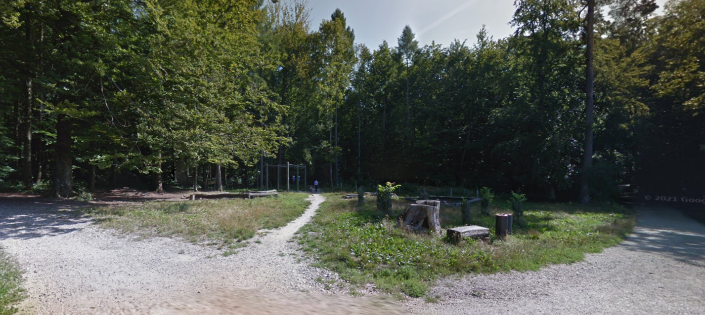
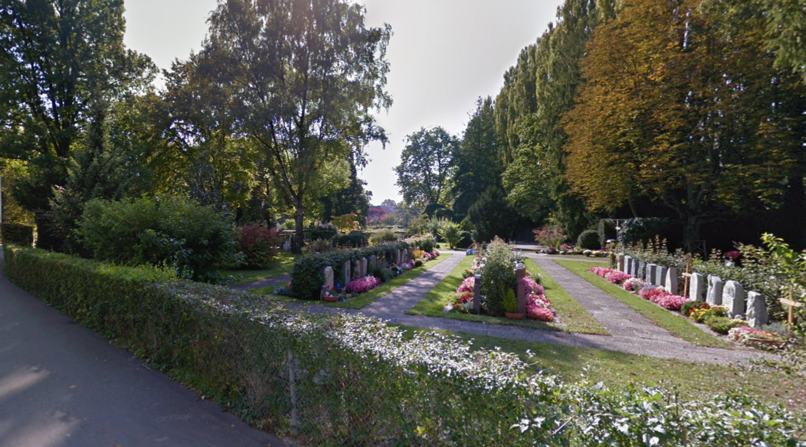
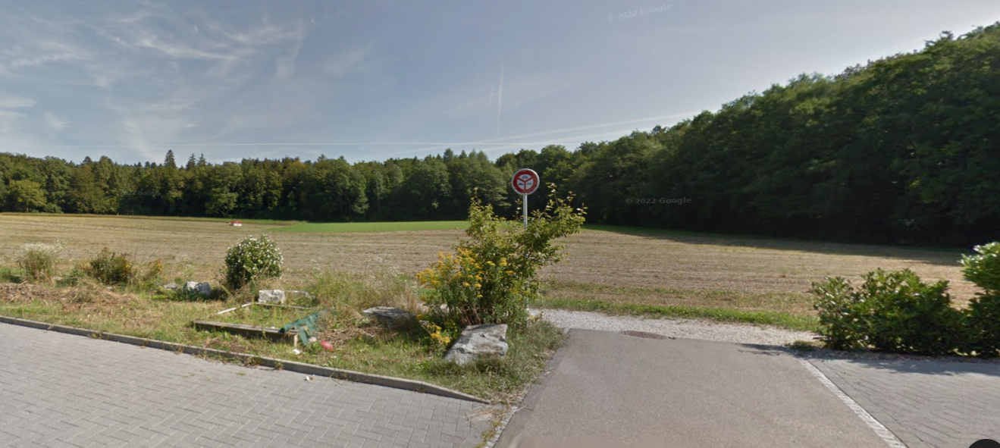
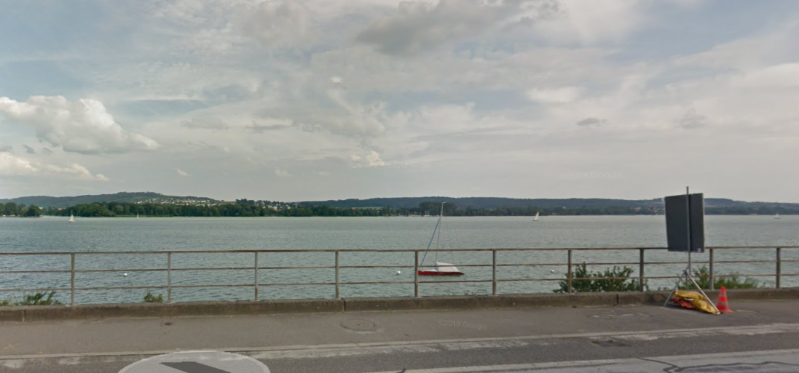

# Local Climate Zones of Biel/Bienne

An additional layer of complexity in the air temperature profile of any urban area is the variation in the canopy layer due to different ground-level features. Local Climate Zone (LCZ) can be defined *as regions of uniform surface cover, structure, material, and human activity that span
hundreds of meters to several kilometers in horizontal scale* {cite}`lcz2012`. Ideally, these regions shold be uniform, but in actuality there is little uniformity, especially on the scale of a small city like Biel/Bienne with a complex topography. Nonetheless, the resulting classificaiton can be useful for model analysis and plannign purposes. The image below from {cite}`Demuzere2021` provides information on the 17 different zones under the classification.

```{figure} figures/lcz/class_lcz.png
---
height: 450px
name: lczchart
---
Guide to LCZ classifications used in this analysis, taken from Demuzere et al. 2021
```

## An overview of the Local Climate Zones in Biel/Bienne
Biel/Bienne can be qualitatively classified as having a central area primarily of compact midrise surrounded by a mix a of open low rise, open high rise, heavy industry, dense trees, low plants, and water. An example of the local climate zone classifications and brief comment on each is avaialble in the table below. Photos taken from Google Street maps on 31.07.2022.

```{list-table} Examples of the LCZs applied to Biel/Bienne
:header-rows: 1

* - Classification name and Photo
  - Comment/Description
* - 2 Compact midrise 
  - The central parts of the city including the Old City and much of the Madretsch neighborhood.
* - 4 Open highrise 
  - These building types are interspered in with open lowrise buildings, but overall make up a small percentage of the LCZs.
* - 6 Open lowrise 
  - The majority of neighborhoods surrounding the city center are a mixture of single story homes and three to four story lowrise appartments, complete with gardens, play areas and garages.
* - 10 Heavy industry 
  - Biel has a signfificant amount of industrial area, especially extending towards Brügg, Boujean/Bözingen and a large central train depot area with adjascent industrial zoning, pictured.
* - A Dense trees 
  - Biel/Bienne has some penetration of forest into the city, particularly the *Längholz* and is borded by a signficant amount of forest on the mountain side.
* - B Scattered trees 
  - Biel/Bienne has a number of parks and even some small pasture areas on the mountains.
* - D Low plants 
  - There are a number of farming areas immediately surrounding Biel/Bienne to the South and the East.
* - G Water 
  - Biel/Bienne is bordered to the West by Lac de Bienne / Bielersee and to the South by the Thielle river and the Nidau-Büren Kanal, which drains the lake. The Suze river also runs through the city
```

## Local Climate Zone Generator

Demuzere published a tool to generate local climate zones based on submitting defined LCZ polygons drawn over the geographic area of interest in a .kml  <https://lcz-generator.rub.de/>. This tool was used to produce two maps of the Local Climate Zones in Biel/Bienne, the final one is available below. {cite}`Demuzere2021`.

```{figure} figures/lcz/lcz_map2.png
---
height: 450px
name: lcz-2
---
A possible LCZ map of Biel/Bienne made from data classifications fed into the LCZ tool.
```

