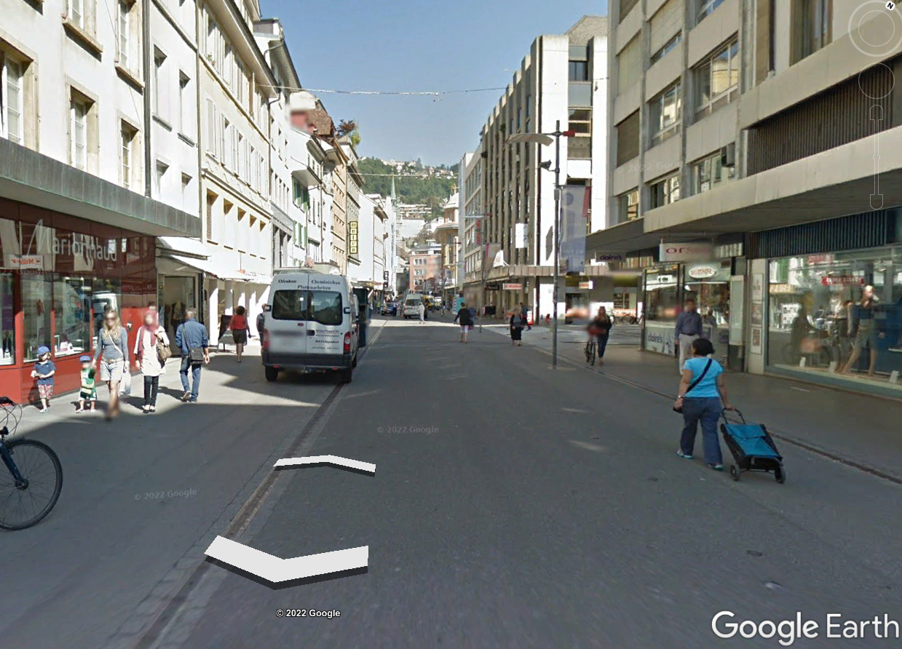
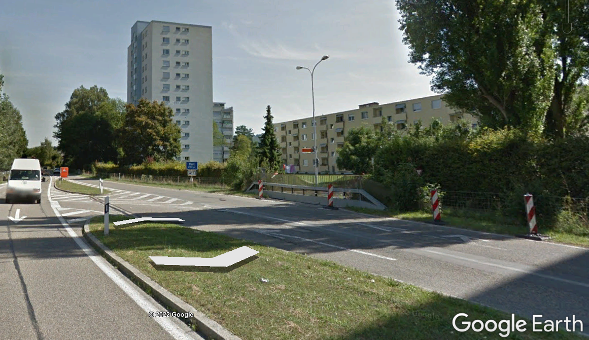
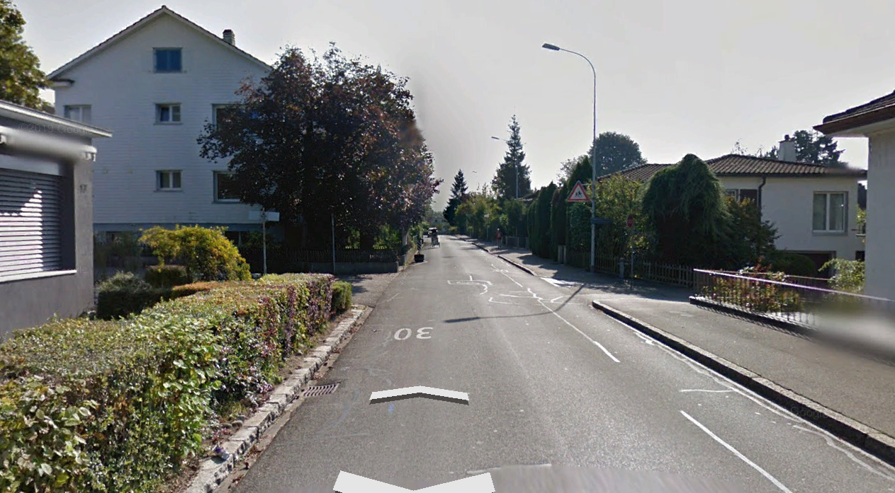
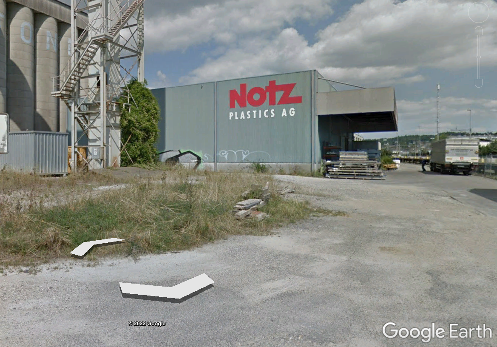

# Local Climate Zones of Biel/Bienne

Biel/Bienne has a unique profile due to its location at the base of the Jura mountain range, and the edge of Bielersee and the larger Seeland region. There a number of elevation changes which can signficantly impact windflow. In addition, the canopy layer itself varies quite a bit over the city and its immediate surroundings. The Local Climate Zone classification is used to classify these features.

## What is a Local Climate Zone
The Local Climate Zone (LCZ) classification is a decade-old classification system for urban landscapes and has become an international standard. The image below from {cite}`Demuzere2021` provides information on the 16 different zones under the classification.

```{figure} figures/lcz/class_lcz.png
---
height: 450px
name: lczchart
---
Guide to LCZ classifications used in this analysis, taken from Demuzere et al. 2021
```

## An overview of the Local Climate Zones in Biel/Bienne
Following this classification, Biel/Bienne and its immediate surroundings hosts a combination of the following built and landcover types:

```{list-table} Reference sites
:header-rows: 1

* - Classification name and Photo
  - Statistic
  - Comment/Description
* - 2 Compact midrise 
  - some statistics
  - some text
* - 4 Open highrise 
  - some statistics
  - Some text
* - 6 Open lowrise 
  - some statistics
  - The majority of neighborhoods surrounding the city center are a mixture of single story homes and three to four story lowrise appartments, complete with gardens, play areas and garages.
* - 10 Heavy industry 
  - some statistics
  - Biel has a signfificant amount of industrial area, especially extending towards Brügg, Boujean/Bözingen and a large central train depot area with surrounding industrial zoning, pictured.
* - A Dense trees 
  - some statistics
  - Biel/Bienne has some penetration of forest into the city, particularly the *Längholz* and is borded by a signficant amount of forest on the mountain side.
* - B Scattered trees 
  - some statistics
  - Biel/Bienne has a number of parks and even some small pasture areas on the mountain 
* - D Low plants 
  - some statistics
  - Some text
* - G Water 
  - some statistics
  - Biel/Bienne is bordered by Lac de Bienne / Bielersee and the Nidau-Büren Kanal, which drains the lake. These two bodies of water likely have a strong effect on air temperatures. 
```

Biel/Bienne can be qualitatively classified as having a central area primarily of compact midrise surrounded by a mix a of open low rise, heavy industry, dense trees, low plants, and water.

## Preliminary Local Climate Zone maps

The LCZ generator tool published in the Demezure et. al 2021 [https://lcz-generator.rub.de/](https://lcz-generator.rub.de/) was used to produce maps of the local climate zone in Biel. Areas were drawn out  New training maps will be generated following the resolution of the classification problems noted above.

```{figure} figures/lcz/lcz_map1.png
---
height: 450px
name: lcz-1
---
The first LCZ map generated with the LCZ Generator Tool
```


```{figure} figures/lcz/lcz_map2.png
---
height: 450px
name: lcz-2
---
The second LCZ map generated with the LCZ Generator Tool
```
Results of the first and second training runs of the local climate zone generator for the city of Biel/Bienne. Notice the more detailed classifications in the second run as more spaces were included in the training file. 

Looking at the overlay of the sensors on this map we can see that we will / we will not capture the following hot zones / cool zones:


```{bibliography}
```