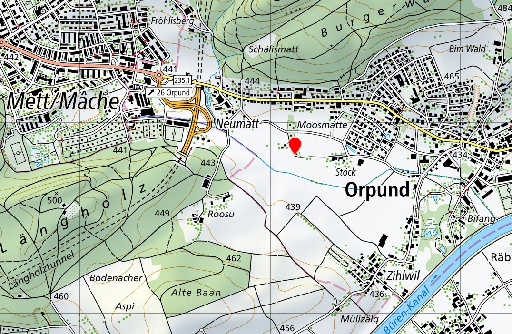
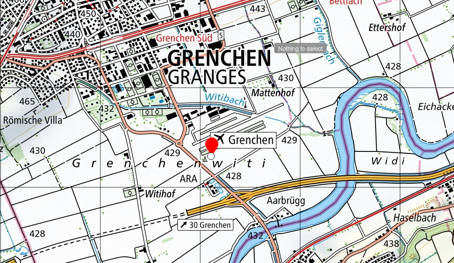

# An overview of the sensor sites

This section will consist of the metadata sheets for each site.

```{list-table} Reference sites
:header-rows: 1

* - Site Name
  - Description
  - Location
  - Photo
* - log_6 - Rural Reference
  - Site is bordered by a blah...
  - 
  - 
* - log_7 - SwissMeteo Reference
  - Site is located next to the Grenchen airport
  - 
  - 
```